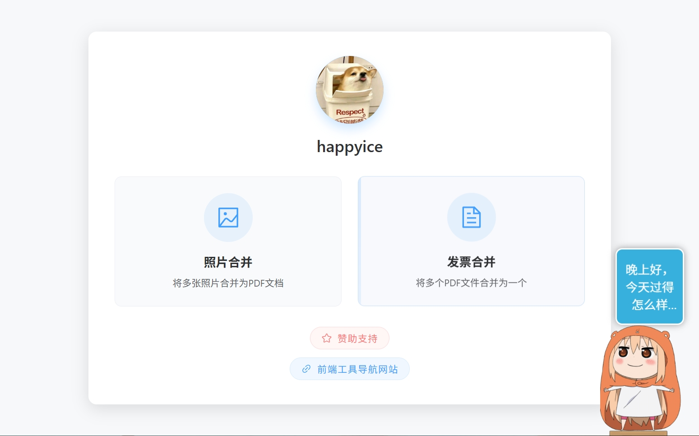
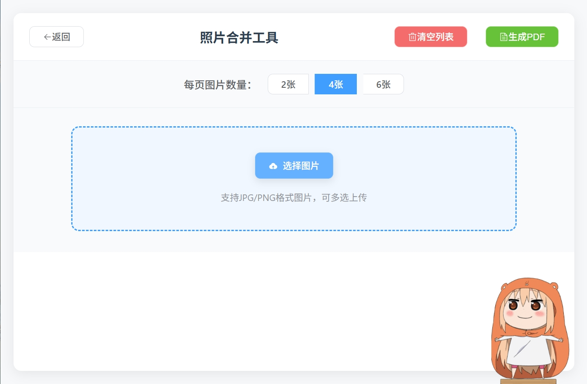
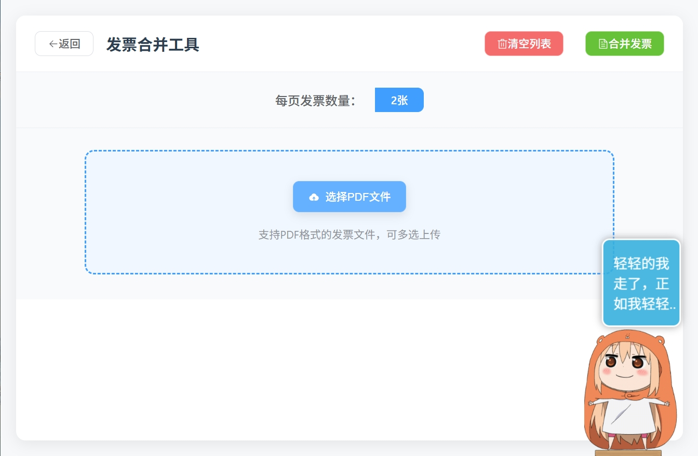

# 合并工具

## 项目简介

基于 Tauri 和 Vue 3 开发的桌面应用程序，用于将多张照片合并为 PDF 文档。

## 技术栈

- **前端框架**：Vue 3 + Vite
- **UI 组件库**：Element Plus
- **桌面应用框架**：Tauri 2.0
- **PDF 处理**：jsPDF
- **看板**：OhMyLive2D

## 开始使用

1. 安装依赖：`npm install`
2. 开发模式启动：`npm run tauri dev`
3. 打包应用：`npm run tauri build`

## 效果图

